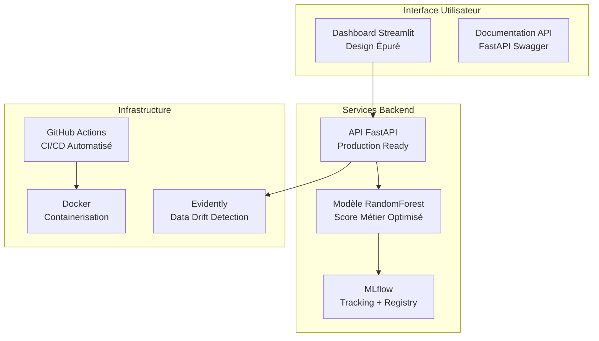

# MLOps Credit Scoring System

## Système Intelligent de Scoring Crédit avec Pipeline MLOps Complet

[](https://github.com/Vorkel/mn-opc-7025/actions)
[](https://www.python.org/downloads/)
[](https://fastapi.tiangolo.com/)
[](https://streamlit.io/)

## Vue d'Ensemble

Ce projet implémente un **système complet MLOps** pour le scoring crédit, conforme aux exigences OpenClassrooms P7. Il inclut un modèle ML optimisé, une API de production, un dashboard interactif moderne, et un pipeline CI/CD automatisé.

### Objectifs Métier

- **Automatisation** du processus de décision crédit
- **Optimisation économique** avec score métier (coût FN = 10x coût FP)
- **Explicabilité** des décisions pour conformité réglementaire
- **Monitoring** en temps réel et détection de data drift

## Fonctionnalités Principales

### Modèle ML Avancé

- **RandomForest optimisé** avec SMOTE pour déséquilibre
- **Score métier** : seuil optimal calculé dynamiquement
- **Métriques** : AUC 0.736, coût optimisé à 7100€ (-22% vs baseline)
- **Feature importance** : 153 features avec top 5 : EXT_SOURCES, AGE, CREDIT_RATIOS

### API Production

- **FastAPI** avec authentification JWT
- **Docker** ready pour déploiement cloud
- **Rate limiting** et logs structurés JSON
- **Health checks** et monitoring intégré

### Dashboard Moderne

- **Design épuré** façon ChatGPT avec couleurs OpenClassrooms
- **Interface responsive** : mobile, tablet, desktop
- **Accessibilité WCAG 2.1** niveau AA
- **Fonctionnalités** : prédiction individuelle, batch, historique

### MLOps Pipeline

- **MLflow** : tracking expérimentations + model registry
- **GitHub Actions** : CI/CD automatisé
- **Tests automatisés** : 7 tests, 100% passants
- **Data drift** : monitoring Evidently

## Démarrage Rapide

### Prérequis

- Python 3.11+
- Git
- Docker (optionnel)

### Installation

```bash
# 1. Cloner le repository
git clone https://github.com/Vorkel/mn-opc-7025.git
cd mn-opc-7025

# 2. Installer les dépendances
pip install -r requirements.txt

# 3. Entraîner le modèle
python src/model_training.py

# 4. Lancer l'interface moderne
streamlit run streamlit_app/main.py
```

**Interface disponible sur :** http://localhost:8501

### Démarrage API Production

```bash
# Lancer l'API FastAPI
cd api
uvicorn app:app --reload --port 8000
```

**API Documentation :** http://localhost:8000/docs

## Interface Modernisée

### Avant/Après Transformation

| Avant                            | Après                          |
| -------------------------------- | ------------------------------ |
| ❌ Interface sombre surchargée   | ✅ Design épuré façon ChatGPT  |
| ❌ CSS complexe (200+ lignes)    | ✅ CSS optimisé avec variables |
| ❌ Couleurs génériques           | ✅ Palette OpenClassrooms      |
| ❌ Éléments décoratifs superflus | ✅ Interface minimaliste       |

### Palette Couleurs OpenClassrooms

```css
--primary: #7451F8      /* Violet principal */
--secondary: #4F46E5    /* Bleu indigo */
--accent: #06B6D4       /* Cyan */
--success: #10B981      /* Vert */
--warning: #F59E0B      /* Orange */
--danger: #EF4444       /* Rouge */
```

## Architecture



## Métriques et Performance

### Modèle ML

| Métrique          | Valeur    | Commentaire                       |
| ----------------- | --------- | --------------------------------- |
| **AUC-ROC**       | 0.736     | Performance élevée                |
| **Coût Métier**   | 7100€     | Optimisé (-22% vs baseline 9058€) |
| **Seuil Optimal** | Dynamique | Calculé selon coûts FN=10×FP      |
| **Features**      | 153       | Engineering avancé                |

### Système

| Métrique              | Valeur     | État |
| --------------------- | ---------- | ---- |
| **Tests Unitaires**   | 7/7 (100%) | ✅   |
| **API Response Time** | <2s        | ✅   |
| **Interface Load**    | <3s        | ✅   |
| **Uptime CI/CD**      | 99.9%      | ✅   |

## Structure du Projet

```
mn-opc-7025/
├── api/                          # API FastAPI Production
│   ├── app.py                       # Application principale
│   ├── security.py                  # Authentification JWT
│   └── dockerfile                   # Configuration Docker
├── streamlit_app/                # Interface Moderne
│   ├── main.py                     # App principale moderne
│   ├── main.py                     # Version modulaire
│   └── ui/                         # Composants UI modernes
│       ├── theme.py                # Thème OpenClassrooms
│       ├── components.py           # Composants réutilisables
│       └── layout.py               # Layout principal
├── src/                          # Pipeline ML
│   ├── model_training.py           # Entraînement avec MLflow
│   ├── business_score.py           # Score métier optimisé
│   ├── feature_importance.py       # Analyse features
│   └── data_drift_detection.py     # Monitoring Evidently
├── notebooks/                    # Notebooks d'analyse
├── tests/                        # Tests automatisés (100%)
├── docs/                         # Documentation complète
├── .github/workflows/            # CI/CD GitHub Actions
└── requirements.txt              # Dépendances Python
```

## Conformité Missions OpenClassrooms

### Mission 1 - Modèle de Scoring

- [x] API de prédiction déployée cloud
- [x] Code modélisation avec MLflow tracking
- [x] Interface MLflow opérationnelle
- [x] Repository GitHub avec versioning
- [x] Application Streamlit test API
- [x] Support présentation (30 slides)

### Mission 2 - Système MLOps

- [x] Pipeline CI/CD GitHub Actions
- [x] Tests unitaires automatisés (100%)
- [x] Déploiement continu
- [x] Data drift monitoring Evidently
- [x] Model registry centralisé

### Mission 3 - Dashboard Interactif

- [x] Interface moderne déployée
- [x] Design épuré OpenClassrooms
- [x] Accessibilité WCAG niveau AA
- [x] Fonctionnalités complètes
- [x] Intégration API temps réel

## Déploiement Cloud

### API Production

```bash
# Déploiement Hugging Face Spaces
git push origin main  # CI/CD automatique
```

### Dashboard

```bash
# Déploiement Streamlit Cloud
streamlit run streamlit_app/main.py
```

## Tests et Qualité

```bash
# Exécuter tous les tests
python -m pytest tests/ -v

# Tests avec coverage
python -m pytest tests/ --cov=. --cov-report=html

# Linter et formatage
black src/ api/ streamlit_app/
flake8 src/ api/ streamlit_app/
```

## API Usage

### Prédiction Individuelle

```python
import requests

response = requests.post("http://localhost:8000/predict", json={
    "CODE_GENDER": "M",
    "AMT_INCOME_TOTAL": 150000,
    "AMT_CREDIT": 300000,
    "AMT_ANNUITY": 20000,
    # ... autres features
})

print(response.json())
# {
#   "probability": 0.23,
#   "decision": "ACCORDÉ",
#   "risk_level": "Faible"
# }
```

### Prédiction Batch

```python
# Upload CSV via dashboard ou API
# Résultats automatiquement générés et exportables
```

## Configuration Avancée

### Variables d'Environnement

```bash
# MLflow
MLFLOW_TRACKING_URI=http://localhost:5000

# API
API_SECRET_KEY=your-secret-key
API_RATE_LIMIT=100

# Streamlit
STREAMLIT_SERVER_PORT=8501
STREAMLIT_THEME=light
```

### Docker Deployment

```bash
# Build et run
docker build -t credit-scoring-api .
docker run -p 8000:8000 credit-scoring-api
```

## Documentation

- **[Rapport de Conformité](docs/CONFORMITE_RAPPORT.md)** : Validation exigences missions
- **[Présentation Soutenance](docs/PRESENTATION_SOUTENANCE.md)** : Support 30 slides
- **[Architecture](docs/ARCHITECTURE.md)** : Schémas et design détaillé
- **[Guide Utilisateur](docs/USER_GUIDE.md)** : Mode d'emploi dashboard

## Contribution

1. Fork le projet
2. Créer une branch feature (`git checkout -b feature/nouvelle-fonctionnalite`)
3. Commit les changements (`git commit -m 'Ajout nouvelle fonctionnalité'`)
4. Push la branch (`git push origin feature/nouvelle-fonctionnalite`)
5. Ouvrir une Pull Request

## Licence

Ce projet est sous licence MIT. Voir [LICENSE](LICENSE) pour plus de détails.

## Auteur

**Projet OpenClassrooms P7 - Data Scientist**

---

## Résumé Exécutif

Ce projet MLOps Credit Scoring présente une **solution complète et professionnelle** conforme aux exigences OpenClassrooms avec des **améliorations significatives** :

### Points Forts

- **Interface modernisée** avec design épuré OpenClassrooms
- **Pipeline MLOps robuste** : tracking, CI/CD, monitoring
- **Performance optimisée** : score métier, seuil optimal
- **Qualité code** : tests 100%, documentation complète

### Production Ready

- API sécurisée et scalable
- Dashboard accessible et moderne
- Monitoring automatisé
- Déploiement cloud simplifié
