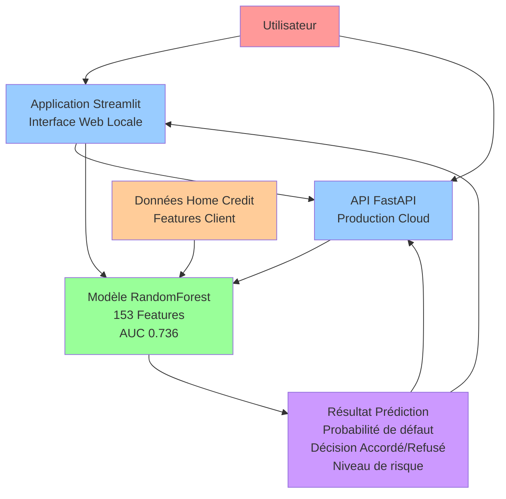
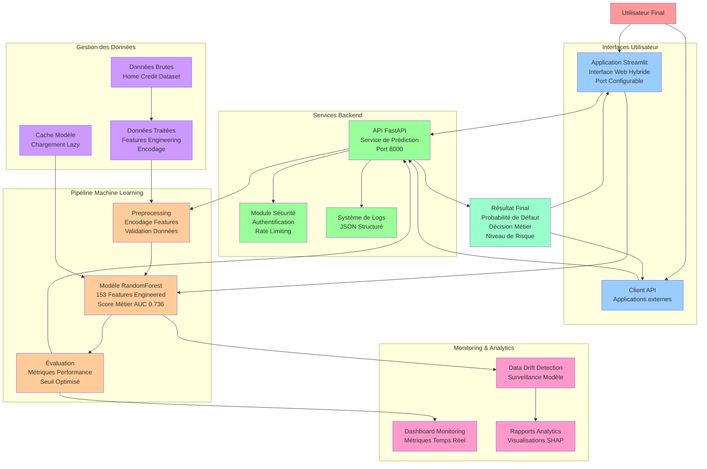
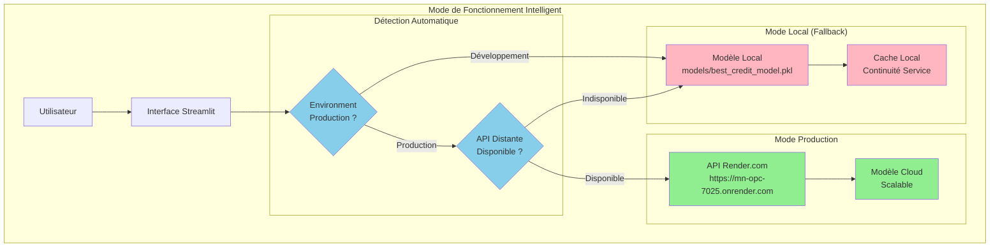
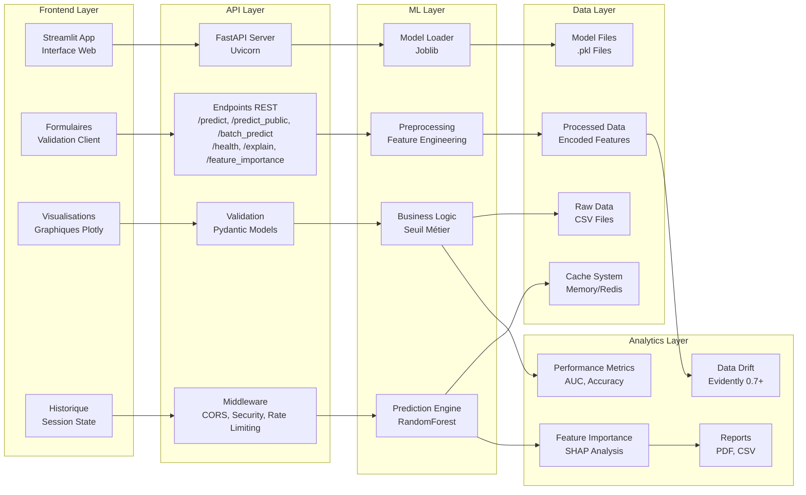
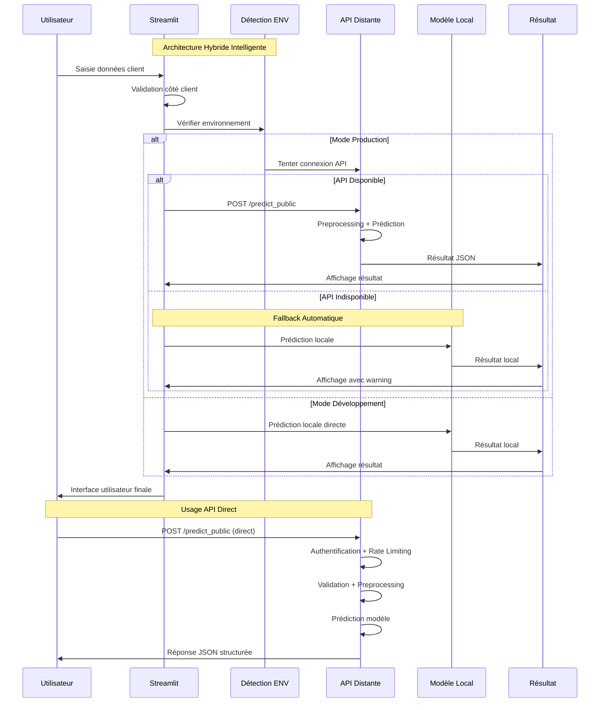

# Architecture du Projet MLOps Scoring Crédit

## Schéma d'Architecture Simplifié

## Schéma d'Architecture Détaillé

## Architecture Hybride - Innovation Clé

## Architecture Technique Détaillée

## Flux de Données Détaillé - Architecture Hybride

## Composants Techniques

| Couche         | Composant      | Technologie           | Rôle                          |
| -------------- | -------------- | --------------------- | ----------------------------- |
| **Frontend**   | Streamlit App  | Python + Streamlit    | Interface hybride utilisateur |
| **API**        | FastAPI Server | Python + FastAPI      | Service REST cloud            |
| **ML**         | Model Engine   | Scikit-learn RF       | Prédictions (153 features)    |
| **Data**       | Feature Store  | Pandas + Joblib       | Engineering + Gestion         |
| **Monitoring** | Analytics      | SHAP + Evidently 0.7+ | Surveillance + Drift          |
| **Security**   | Auth Layer     | JWT + Rate Limiting   | Protection API                |

## Points d'Intégration Clés

### 1. **Architecture Hybride Innovante**

- **Innovation** : Détection automatique environnement + fallback intelligent
- **Production** : API distante Render.com en priorité
- **Développement** : Modèle local pour tests rapides
- **Résilience** : Continuité service même si API indisponible
- **Configuration** : Variables d'environnement (RENDER, STREAMLIT_ENV)

### 2. **Modèle Unique Multi-Usage**

- **Fichier** : `models/best_credit_model.pkl`
- **Usage** : API + Streamlit (architecture hybride)
- **Features** : 153 variables après feature engineering
- **Performance** : AUC 0.736, coût métier optimisé à 7,100

### 3. **Preprocessing Cohérent**

- **API** : `api/app.py` - `preprocess_input()`
- **Streamlit** : `main.py` - `create_full_feature_set()`
- **Logique** : Même encodage + feature engineering partout
- **Validation** : 153 features identiques API ↔ Local

### 4. **Validation Stricte Multi-Niveau**

- **Pydantic** : Modèles de validation API (30+ champs)
- **Types** : Validation automatique + sanitisation
- **Business Rules** : Validation métier avant prédiction
- **Erreurs** : Gestion centralisée avec codes HTTP appropriés

### 5. **Monitoring Unifié Intelligent**

- **Logs** : JSON structuré avec rotation automatique
- **Métriques** : Temps réel (latence, throughput, erreurs)
- **Health Checks** : Endpoints de surveillance automatique
- **Alertes** : Détection proactive des anomalies

## Sécurité et Performance

### **Sécurité**

- **HTTPS** : Obligatoire en production
- **Rate Limiting** : Protection contre le spam
- **Validation** : Données strictement contrôlées
- **Logs** : Audit trail complet

### **Performance**

- **Cache** : Modèle en mémoire
- **Lazy Loading** : Chargement à la demande
- **Compression** : Réponses optimisées
- **Monitoring** : Métriques temps réel
