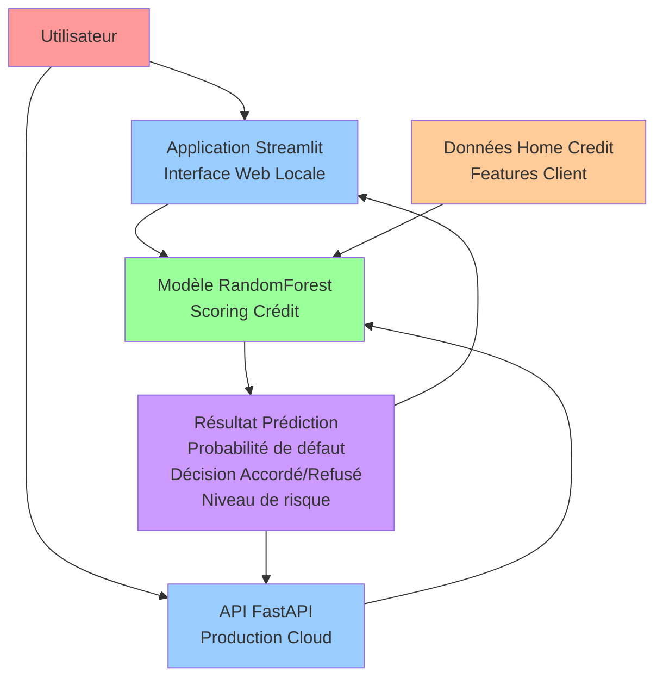
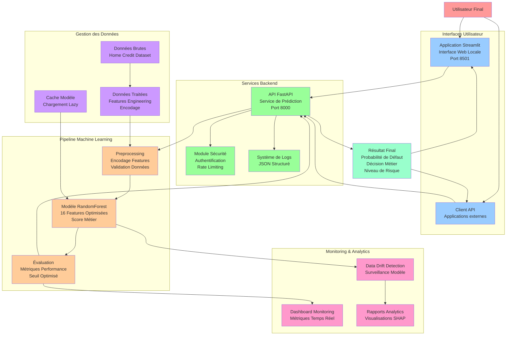
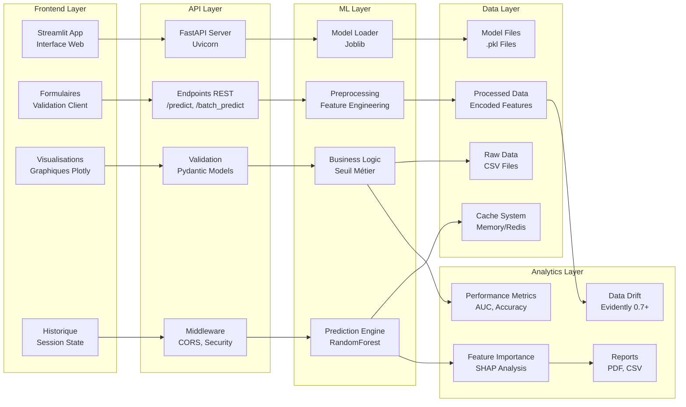
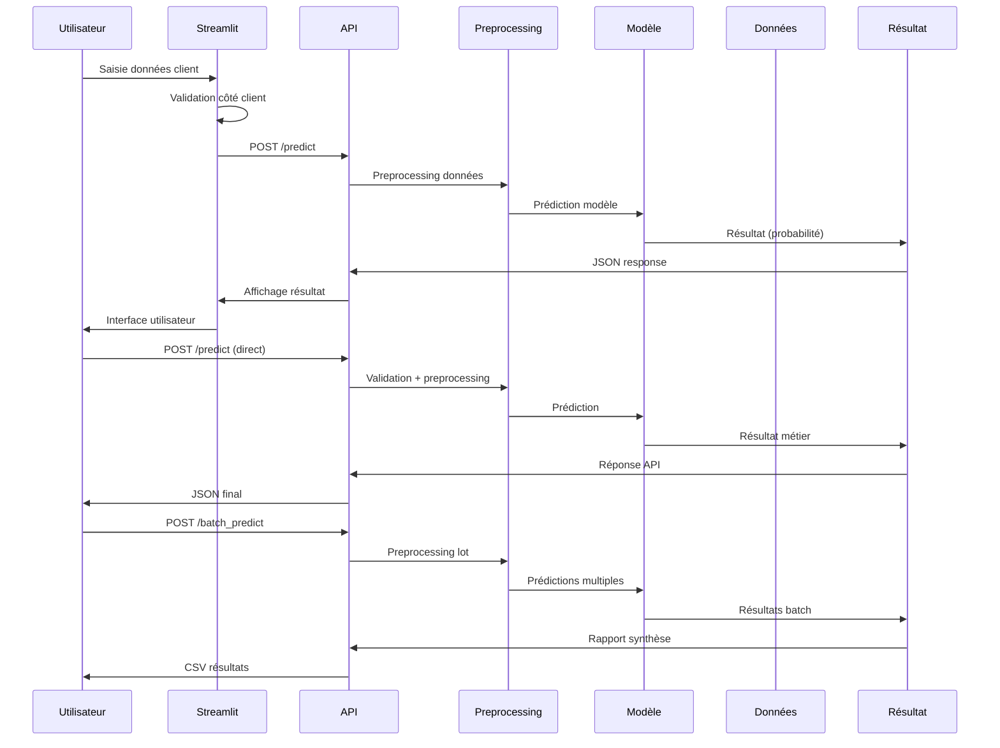

# Architecture du Projet MLOps Scoring Crédit

## Schéma d'Architecture Simplifié

## Schéma d'Architecture Détaillé

## Architecture Technique Détaillée

## Flux de Données Détaillé

## Composants Techniques

| Couche         | Composant      | Technologie           | Rôle                  |
| -------------- | -------------- | --------------------- | --------------------- |
| **Frontend**   | Streamlit App  | Python + Streamlit    | Interface utilisateur |
| **API**        | FastAPI Server | Python + FastAPI      | Service REST          |
| **ML**         | Model Engine   | Scikit-learn          | Prédictions           |
| **Data**       | Feature Store  | Pandas + Joblib       | Gestion données       |
| **Monitoring** | Analytics      | SHAP + Evidently 0.7+ | Surveillance          |

## Points d'Intégration Clés

### 1. **Modèle Unique**

- **Fichier** : `models/best_credit_model.pkl`
- **Usage** : API + Streamlit
- **Features** : 16 variables standardisées

### 2. **Preprocessing Cohérent**

- **API** : `api/app.py` - `preprocess_input()`
- **Streamlit** : `main.py` - `preprocess_for_prediction()`
- **Logique** : Même encodage partout

### 3. **Validation Stricte**

- **Pydantic** : Modèles de validation
- **Types** : Validation automatique
- **Erreurs** : Gestion centralisée

### 4. **Monitoring Unifié**

- **Logs** : JSON structuré
- **Métriques** : Temps réel
- **Alertes** : Proactives

## Sécurité et Performance

### **Sécurité**

- **HTTPS** : Obligatoire en production
- **Rate Limiting** : Protection contre le spam
- **Validation** : Données strictement contrôlées
- **Logs** : Audit trail complet

### **Performance**

- **Cache** : Modèle en mémoire
- **Lazy Loading** : Chargement à la demande
- **Compression** : Réponses optimisées
- **Monitoring** : Métriques temps réel
